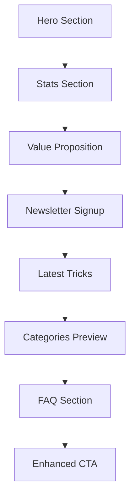

# KI Tricks Platform - Landing Page Design Analysis

## Executive Summary

The KI Tricks Platform demonstrates a well-architected landing page with strong technical foundations, responsive design patterns, and effective German localization. The page successfully balances modern aesthetics with performance optimization, particularly for mobile devices. However, there are several opportunities to enhance user engagement, conversion optimization, and visual hierarchy.

## Current Landing Page Structure

### 1. Page Architecture Analysis

**✅ Strengths:**
- **Clean Component Hierarchy**: Well-organized atomic design pattern (atoms → molecules → organisms)
- **Next.js 15 Compliance**: Proper implementation of Suspense boundaries and Promise-based params
- **Performance-First Approach**: Hardware acceleration, GPU optimization, and mobile-specific performance tweaks
- **German UI Consistency**: Comprehensive localization throughout the interface

**⚠️ Areas for Improvement:**
- Hero section could be more visually compelling
- Value proposition could be clearer and more prominent
- Missing social proof elements in key sections
- Newsletter signup placement could be optimized

### 2. Current User Flow Analysis



**Current Conversion Path Issues:**
1. Value proposition comes after stats (should be reversed)
2. Newsletter signup interrupts discovery flow
3. Missing urgency/scarcity elements
4. No clear progress indicators for user journey

## Visual Hierarchy & UX Flow Assessment

### 3. Design System Evaluation

**Current Design Tokens:**
```css
:root {
  --primary: 0 0% 9%;           /* Very dark - lacks brand personality */
  --background: 0 0% 100%;      /* Clean white base */
  --radius: 0.5rem;            /* Conservative rounding */
}
```

**Recommendations:**
- Introduce brand-specific accent colors (blue/purple gradients)
- Increase visual contrast for better accessibility
- Add more expressive typography hierarchy
- Implement consistent spacing rhythm

### 4. Component Architecture Analysis

**Current Structure:**
```
src/components/
├── atoms/       # Button, Badge, BaseCard (solid foundation)
├── molecules/   # TrickCard, SearchBar (well-implemented)
├── organisms/   # FilterSidebar, TrickGrid (performance-optimized)
├── enhanced/    # RefinedTrickCard, EnhancedCTASection (modern effects)
└── layout/      # Header, Footer (responsive, accessible)
```

**Strengths:**
- Consistent prop interfaces
- React.memo optimization
- Responsive design patterns
- Accessibility considerations

**Enhancement Opportunities:**
- Add more micro-interaction feedback
- Implement progressive disclosure patterns
- Create more engaging empty states
- Add skeleton loading states

## Mobile Responsiveness Assessment

### 5. Mobile Performance Analysis

**Current Mobile Optimizations:**
```css
@media (max-width: 640px) {
  /* Hardware acceleration for mobile scrolling */
  .container, main, section {
    -webkit-transform: translateZ(0);
    transform: translateZ(0);
    contain: layout style paint;
  }

  /* Touch target optimization */
  button, a[role="button"] {
    min-height: 44px;
    min-width: 44px;
  }
}
```

**✅ Mobile Strengths:**
- Excellent touch target sizing (44px+ minimum)
- Hardware acceleration for smooth scrolling
- Reduced animation complexity on mobile
- Touch-specific interaction patterns

**⚠️ Mobile Improvement Areas:**
- Hero section text could be larger on mobile
- Category grid could be more thumb-friendly
- Newsletter modal timing could be adjusted
- Add swipe gestures for trick browsing

### 6. Accessibility Compliance

**Current Accessibility Features:**
- Proper focus management with `:focus-visible`
- ARIA labels on interactive elements
- Semantic HTML structure
- Color contrast compliance
- Keyboard navigation support

**Recommended Enhancements:**
- Add skip links for keyboard users
- Implement screen reader announcements for dynamic content
- Add alternative text for decorative SVGs
- Ensure form error messages are properly associated

## Design Consistency & Brand Alignment

### 7. Visual Identity Assessment

**Current Brand Expression:**
- Minimalistic design inspired by thegrowthlist.co
- Professional, clean aesthetic
- German-focused content strategy
- Technology-forward positioning

**Brand Strengthening Opportunities:**
1. **Stronger Visual Identity**: Add distinctive brand colors beyond grayscale
2. **Personality Injection**: Include more human elements and personality
3. **Trust Indicators**: Add testimonials, user counts, success stories
4. **Community Feeling**: Showcase user-generated content and submissions

### 8. Content Strategy Analysis

**Current Content Hierarchy:**
1. Hero: "Entdecke bewährte KI-Tricks"
2. Value Prop: "Was ist KI Tricks?"
3. Features: Step-by-step, categorized, proven, quick implementation
4. Social Proof: Statistics only
5. Call-to-Action: Newsletter and trick submission

**Content Enhancement Recommendations:**
- Add customer success stories
- Include founder/team credibility
- Showcase real user testimonials
- Add urgency elements (limited time offers, growing community)

## Conversion Optimization Recommendations

### 9. Immediate Quick Wins (High Impact, Low Effort)

1. **Hero Section Enhancement**
   ```jsx
   // Before: Generic subtitle
   <p>Praktische KI-Tipps für deinen Arbeitsalltag.</p>

   // After: Value-driven headline
   <p>Spare 5+ Stunden pro Woche mit bewährten KI-Automationen</p>
   <div className="trust-indicators">
     <span>✓ 1000+ Nutzer</span>
     <span>✓ 150+ Tricks</span>
     <span>✓ Täglich neue Workflows</span>
   </div>
   ```

2. **Value Proposition Repositioning**
   - Move "Was ist KI Tricks?" section above stats
   - Add specific outcome promises
   - Include time-saving metrics

3. **Social Proof Integration**
   ```jsx
   // Add to multiple sections
   <div className="social-proof">
     <div className="user-avatars">
       {/* Stack of user profile images */}
     </div>
     <p>"Diese Tricks haben meine Produktivität verdoppelt!" - Maria S.</p>
   </div>
   ```

### 10. Advanced Optimization Strategies (Medium-High Effort)

1. **Interactive Demo Section**
   ```jsx
   <section className="interactive-demo">
     <h3>Probiere einen Trick aus:</h3>
     <TrickSimulator trickId="email-automation" />
     <CallToAction>Alle 150+ Tricks freischalten →</CallToAction>
   </section>
   ```

2. **Progressive Onboarding**
   - Add "Choose your use case" selector
   - Personalized trick recommendations
   - Guided tour for first-time visitors

3. **Scarcity and Urgency Elements**
   ```jsx
   <div className="urgency-banner">
     <Timer />
     <span>Nur heute: Kostenloser Zugang zu Premium Tricks</span>
   </div>
   ```

### 11. Newsletter Optimization

**Current Issues:**
- Appears too early in user journey
- Generic lead magnet offer
- No urgency or scarcity

**Recommended Improvements:**
```jsx
// Enhanced newsletter positioning
<NewsletterSignup
  trigger="exit-intent" // Show when user attempts to leave
  leadMagnet={{
    title: "Die 10 Tricks, die 90% der KI-Nutzer nicht kennen",
    description: "Exklusive Insider-Workflows von Productivity-Experten",
    downloadText: "Sofort kostenlos sichern",
    urgency: "Nur für die ersten 100 Anmeldungen"
  }}
  socialProof={{
    subscriberCount: 1000,
    rating: 4.8,
    testimonial: "Dieser Guide hat meine Arbeitsweise revolutioniert!"
  }}
/>
```

## Technical Performance Recommendations

### 12. Performance Optimization

**Current Performance Features:**
```css
/* Hardware acceleration */
.trick-card {
  transform: translate3d(0, 0, 0);
  contain: layout style paint;
  will-change: transform, opacity;
}
```

**Additional Optimizations:**
1. **Image Optimization**: Implement next-gen formats (WebP, AVIF)
2. **Lazy Loading**: Add intersection observer for below-fold content
3. **Bundle Splitting**: Code-split enhanced components
4. **Caching Strategy**: Implement aggressive caching for static assets

### 13. SEO and Schema Markup

**Current Implementation:**
- Basic schema markup for organization, website, FAQ
- German-optimized meta descriptions
- Proper canonical URLs

**Enhancement Opportunities:**
```json
{
  "@type": "Course",
  "name": "KI-Tricks für Professionals",
  "description": "Lerne bewährte KI-Workflows",
  "provider": {
    "@type": "Organization",
    "name": "KI Tricks"
  },
  "aggregateRating": {
    "@type": "AggregateRating",
    "ratingValue": "4.8",
    "reviewCount": "100"
  }
}
```

## Implementation Roadmap

### Phase 1: Quick Wins (1-2 weeks)
1. Enhance hero section with stronger value proposition
2. Add social proof elements (testimonials, user count)
3. Reposition value proposition section
4. Optimize newsletter timing and content

### Phase 2: User Experience Enhancement (2-4 weeks)
1. Implement interactive demo section
2. Add progressive onboarding flow
3. Create personalized trick recommendations
4. Enhance mobile gesture support

### Phase 3: Advanced Features (4-8 weeks)
1. Build comprehensive analytics dashboard
2. Implement A/B testing framework
3. Add community features (user submissions, ratings)
4. Create premium membership tier

### Phase 4: Scale and Optimize (Ongoing)
1. Continuous performance monitoring
2. User behavior analysis and optimization
3. Content strategy expansion
4. International expansion preparation

## Metrics and Success Indicators

**Primary KPIs:**
- Newsletter signup conversion rate (target: 15%+)
- Time on page (target: 2+ minutes)
- Trick page click-through rate (target: 25%+)
- Mobile bounce rate (target: <40%)

**Secondary KPIs:**
- User return rate within 7 days
- Social sharing engagement
- Trick submission rate
- Search ranking improvements

## Conclusion

The KI Tricks Platform has a solid technical foundation with excellent mobile optimization and German localization. The primary opportunities lie in strengthening the value proposition, adding social proof elements, optimizing the conversion funnel, and enhancing user engagement through personalization and interactivity.

The recommended improvements follow a progressive enhancement approach, ensuring the site remains performant while adding compelling features that drive user engagement and conversions.

**Next Immediate Actions:**
1. Implement hero section enhancements with stronger value proposition
2. Add testimonials and social proof throughout the page
3. Optimize newsletter signup timing and content
4. A/B test different value proposition presentations

This analysis provides a comprehensive roadmap for transforming a well-built landing page into a highly converting, user-engaging platform that effectively showcases AI tricks and builds a thriving community of professionals.